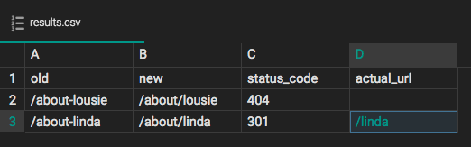

# redirect-test

[](https://www.npmjs.com/package/redirect-test)
[](https://travis-ci.org/cpitkin/redirect-test)
[](https://codeclimate.com/github/cpitkin/redirect-test)
[](https://codeclimate.com/github/cpitkin/redirect-test/coverage)
[](https://codeclimate.com/github/cpitkin/redirect-test)
[](https://david-dm.org/cpitkin/redirect-test)

> Test your redirects and get an easily readable and parsable csv file back. Testing a lot of redirects is hard and this cli aims to make it easier and less time consuming.

## Install

yarn

```sh
$ yarn global add redirect-test
```

npm

```sh
$ npm i -g redirect-test
```

## Usage

```sh
redirect-test <file> <url> [options]
```
#### Required fields

`file`: A csv file in the following format:
`old-URL,new-URL` eg. `/about-bob,/about/bob`

`url`: The URL must be the final URL for the site. If it is not the redirect will get caught to early by conditionals such as non-www -> www and http -> https. Since this tool is not meant to test those types of redirects you will want to use the proper FQDN.

#### Options

`-c, --csv`: This will allow you to output to a custom csv file name and path. Default: ./results.csv

`-q, --quite`: This will limit the console output to only print the csv file path.

`-n, --number`: The number of concurrent requests to make to the testing URL at a time. Default: 5

## Results



## Tests

yarn
```sh
yarn test
```

If you want to dev locally and run tests on file changes you can run the following.

```sh
yarn test-local
```

*NOTE:* I politely ask that all pull requests have proper tests otherwise you will be asked to add them.

## License

[MIT © 2017 Charlie Pitkin](LICENSE)

### [Changelog](CHANGELOG.md)
